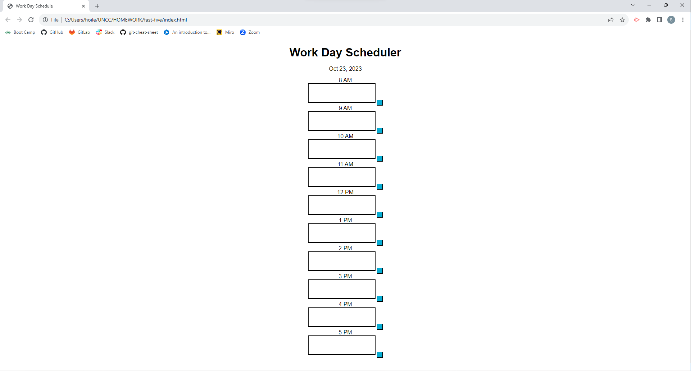
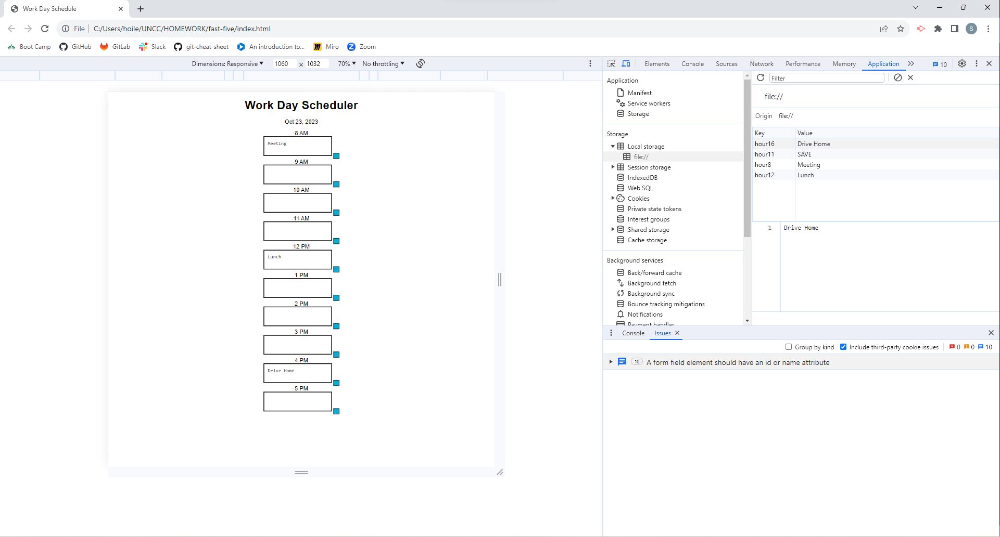

## Your Task
Create a simple calendar application that allows a user to save events for each hour of a typical working day (9am–5pm) by modifying starter code. This app will run in the browser and feature dynamically updated HTML and CSS powered by jQuery.
You'll need to use the Day.js library to work with date and time. Be sure to read the documentation carefully and concentrate on using Day.js in the browser.

## User Story
AS AN employee with a busy schedule
I WANT to add important events to a daily planner
SO THAT I can manage my time effectively

## Acceptance Criteria
GIVEN I am using a daily planner to create a schedule
WHEN I open the planner
THEN the current day is displayed at the top of the calendar
WHEN I scroll down
THEN I am presented with timeblocks for standard business hours of 9am&ndash;5pm
WHEN I view the timeblocks for that day
THEN each timeblock is color coded to indicate whether it is in the past, present, or future
WHEN I click into a timeblock
THEN I can enter an event
WHEN I click the save button for that timeblock
THEN the text for that event is saved in local storage
WHEN I refresh the page
THEN the saved events persist

## Mock Up
I need to develop a work calender for employees to use during their work hours.

## Technology Used
I used CSS and HTML for this project in order to build and style this website. After that, I used JavaScript to create the functions for the calender

## Links 
GitHub Repo: [https://github.com/spencer1227/fast-five]

Deploy: [https://spencer1227.github.io/fast-five/]

## Screenshot

